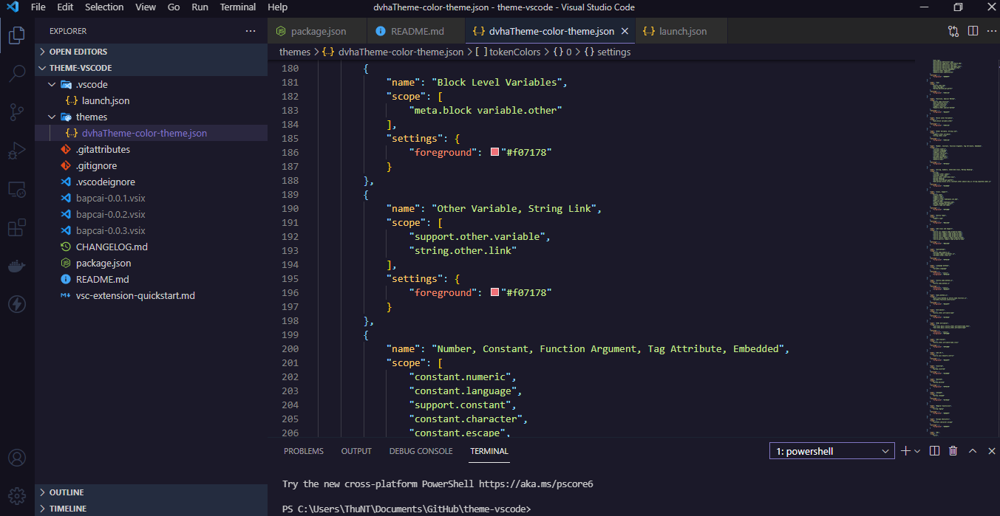
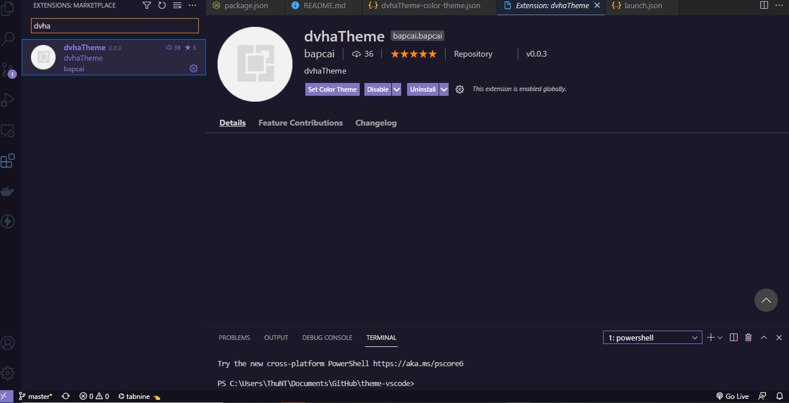

<p align="center" style="font-weight: bold; text-align: center; font-family: monospace; padding-bottom: 15px;">DIY your own favorite theme</p>


## Introduction

<p align="center">
  
</p>

## How to use?

1. Add extencitons(Ctrl + Shift + X)

```
2. Install extencitons

search 'dvha-Theme'
```
click install

 <p align="center">
  
</p>
